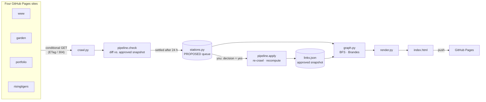
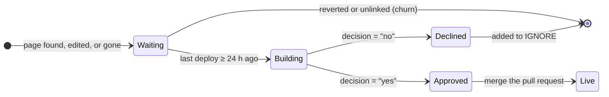

# Grand Central Station

The source for **[www.tahreemkarim.xyz](https://www.tahreemkarim.xyz)**, the hub that connects my [digital garden](https://garden.tahreemkarim.xyz), [portfolio](https://portfolio.tahreemkarim.xyz) and the [Rising Tigers Initiative](https://risingtigers.tahreemkarim.xyz). The hub's centerpiece is a generated, subway-style map of every page I publish. It's drawn from the hyperlinks that actually exist across the four sites, and a small pipeline keeps it current on its own.

[](https://github.com/TahreemK13/Grand_Central_Station/issues/new?title=Map%20check&body=Submitting%20this%20issue%20runs%20a%20live%20check%20of%20my%20sites%20against%20the%20system%20map%20on%20www.tahreemkarim.xyz.%0A%0AA%20bot%20replies%20in%20about%20a%20minute%20with%20any%20page%20the%20map%20hasn%27t%20caught%20yet%2C%20then%20closes%20the%20issue.%20The%20check%20is%20read-only%2C%20so%20feel%20free%20to%20submit%20it%20as%20is.)
[](https://github.com/TahreemK13/Grand_Central_Station/actions/workflows/map-pipeline.yml)

<sub>Did I publish something the map hasn't picked up yet? Press the first button and submit the issue it opens. A bot compares the live sites with the map and replies with what it finds. The check is read-only.</sub>

## Highlights

| | |
| --- | --- |
| **Graph analytics** | Breadth-first search gives each page its click distance from the hub. Brandes' algorithm (O(V·E)) weights every link by edge betweenness: its share of all shortest paths between every pair of pages. |
| **Deterministic static generation** | Same inputs, byte-identical output, verified in CI. A diff only ever shows real change. |
| **Event-driven, human-in-the-loop pipeline** | Change detection → a 24-hour debounce → a provisional render → approval by pull request → a full recompute. |
| **Cache-aware crawling** | Conditional GETs (`ETag` / `304 Not Modified`). A quiet hourly check is about 18 empty responses: no downloads, no parsing. |
| **Safe self-modifying config** | Approvals edit the data module through its abstract syntax tree, not regex, so hand formatting survives. |
| **Hermetic tests** | 11 lifecycle scenarios run against a simulated web and clock. Browser gates cover rendering, accessibility, links and performance budgets. |
| **Zero runtime dependencies** | The pipeline is standard-library Python. The page is static HTML and CSS, plus about 200 lines of vanilla JavaScript in `hub.js`. |

## Architecture



- **Rendering is a pure function.** It takes `stations.py` and `links.json` and writes the map, the directory and a status block into marked regions of `index.html`. Nothing else in the page is touched.
- **The pipeline moves state** between those two files, under a scheduler and an approval gate.

## Repository layout

```
index.html              the hub page; the map is rendered into it
hub.js                  the hub's script: menu, map centering, reveal, route tracing, live check
style.css, 404.html     shared styles for the other pages; the not-found page
now.html … travel.html  the other home-line pages
tools/
  build_map.py          command-line entry point
  links.json            approved snapshot: every link on every mapped page, with ETags
  gcmap/                the map package, in dependency order:
    settings.py         tunables: my hosts, the settle window, map geometry
    stations.py         the data you edit: stops, lines, the approval queue
    clock.py            UTC storage, Pacific display, a GC_NOW override for tests
    crawl.py            conditional HTTP, link extraction, canonical URL identity
    graph.py            click distance, edge betweenness, the impact report
    render.py           layout, SVG, directory, status block
    pipeline.py         check → settle → draw → approve → apply → verify
tests/
  test_pipeline.py      lifecycle scenarios (standard library only)
  test_hub.py           quality gates (Playwright for rendering)
  fakeweb/              the simulated web the scenarios run against
.github/workflows/
  map-pipeline.yml      schedules, approval, tests, the public check
SETUP.md                one-time hosting setup: repo, Pages, DNS
```

## The map

| Element | Meaning |
| --- | --- |
| **Lines** | Sites. Home runs west, Garden north, Rising Tigers east, Portfolio south; profiles sit on two short shuttle spurs. |
| **Rings** | Click distance: the fewest clicks from the hub to that page. |
| **Connectors** | Links between pages. Stroke width scales with edge betweenness. |
| **Bullets** | The other lines a page links to. |
| **Orange, dashed** | Under construction. A new page (open ring), or an edited page (its track and connectors), waiting for approval. |

Hover or keyboard focus traces a stop's shortest route from the hub. The map is framed symmetrically around the hub, which sits at the exact center at every viewport size. It fits the window height down to a readable minimum, draws itself outward once on first view (skipped under `prefers-reduced-motion`), and gives every stop a touch target of at least 24 px, the WCAG 2.2 minimum. Without JavaScript you get the finished map.

### How the graph is computed

1. **Crawl.** Every `<a href>` on each page is recorded by section (nav, header, body, footer). URLs are canonicalized: host, trailing slash, `index.html`, `.html`, known redirects, and GitHub's case-insensitive paths. That way one page always has one identity.
2. **Rings.** Breadth-first search from the hub over the directed link graph. Ties prefer staying on the same line, so routes read naturally.
3. **Connectors.** [Brandes' algorithm](https://snap.stanford.edu/class/cs224w-readings/brandes01centrality.pdf) runs one BFS per page, counts shortest paths, then accumulates each link's dependency backward. That gives all-pairs edge betweenness in O(V·E) instead of enumerating every pair. The hub's own links and adjacent track segments aren't drawn as connectors, since the rings and tracks already show them.

## The change pipeline



**What counts as a change**

| Kind | Detected when | Drawn as |
| --- | --- | --- |
| New page | A mapped page links to one of my pages, or to one of my GitHub repos, that it didn't link to at its last approval. Any link form counts: root, `#readme` or README file. | An open orange ring at the end of the linking page's line |
| Edited page | Its links or its content fingerprint differ from the approved snapshot | Its track segment and connectors in orange dashes |
| Gone page | It answers 404 or 410 | Struck through |

**Settling (the debounce).** A change is drawn only once its last deploy is 24 hours old. For GitHub Pages that's `Last-Modified`; for a repo it's the API's `pushed_at`; if neither is available, it's the time the change was first seen. Work in progress that's published and pulled the same day never reaches the map. Waiting changes are recomputed from deploy times on every run rather than stored. Committing them would redeploy the hub and reset its own clock.

**Provisional means outside the math.** Under-construction stops are drawn, but kept out of the breadth-first search and the betweenness computation. They can't reshape the map before approval.

**Schedules.**

| Run | When | Scope |
| --- | --- | --- |
| Edits check | Hourly | Edited pages only, so edits appear within the hour after they settle |
| Full check | Mondays, 8:43 am PDT | New, edited and gone pages |
| On demand | Actions → *Map pipeline* → *Run workflow*, or `gh workflow run map-pipeline.yml -f task=check` | Either task |

A check commits to `main` only when something newly settles, and only if every gate passes. Otherwise it commits nothing.

### Approving

In `tools/gcmap/stations.py` on `main` (GitHub's pencil icon works), change one word:

```python
PROPOSED = {
    "grand-central-station": dict(action="add", name="Grand Central Station",
        href="https://github.com/tahreemk13/grand_central_station", line="portfolio",
        deployed="2026-10-05T16:30Z", seen="2026-10-06T18:00Z", stage="building",
        decision="pending"),   # ← "yes" or "no"
}
```

The commit triggers **apply** on a `map-update` branch:
1. It writes approved stops into `STATIONS` and `LINES`, drops declined ones into `IGNORE`, and removes gone ones.
2. It re-crawls every page into a fresh snapshot.
3. It recomputes the rings and all-pairs shortest paths.
4. It stamps the dated notice under the map, e.g. "Map updated Oct 6, 2026, 1:14 pm PDT · Added Grand Central Station".
5. It runs the tests and gates, then opens a pull request with an impact report:

```
| | Before | After |
| Stops on the graph         |   32 |   33 |
| Connected ordered pairs    |  558 |  576 |
| Mean shortest path, clicks | 1.89 | 1.90 |
- Joins at 1 click: Grand Central → Grand Central Station
- Busiest connectors: Math, Murder, and Making a Difference ↔ Portfolio 36.55 (+1.5) …
```

Merging publishes it; reverting the merge undoes it. A full refresh with no decisions is `-f task=apply`.

### The live check on the home page

Under the map, *Check for new pages* runs the same comparison in the visitor's browser, with no account or server. GitHub Pages serves cross-origin reads, so the browser fetches the mapped pages directly. It reports *New page found!* or *No new pages found*, plus any page that has gone missing. Optionally, set `NOTIFY_TOPIC` in `stations.py` to an [ntfy](https://ntfy.sh) topic to get a phone push when a visitor finds something.

## Quality gates

`tests/test_hub.py` runs before anything reaches `main` or a pull request:

- **Lint:** pyflakes across `tools/` and `tests/`, plus unused CSS in the hub.
- **Budgets:** page ≤ 160 KB, map ≤ 2,500 SVG elements, render ≤ 3 s. It's currently 99 KB, 417 elements, 0.12 s.
- **Links:** every same-site link and `#anchor` resolves, and with `--online`, every link to my sites and repos answers 200.
- **Rendering, at 390, 768, 1440 and 1920 px:**
  - no script errors
  - no sideways scroll
  - the hub centered to within 1.5 px
  - 24 px touch targets
  - no two labels overlapping, tested as rotated rectangles with the separating-axis theorem
  - a preview image uploaded as a workflow artifact

`tests/test_pipeline.py` covers the lifecycle end to end:

| Scenario | Guarantees |
| --- | --- |
| Quiet check | An unchanged web costs only 304s |
| Edit | Waits the full day, then turns orange |
| Churn | A page published and pulled before settling never lands |
| New page, any link form | Detected by diff, placed on the linking line, kept out of the math |
| Approval | Source edited, graph recomputed, notice stamped, next check quiet |
| Decline | Remembered, never proposed again |
| Gone page | Marked, then removed on approval |
| Outage | An unreachable site proposes nothing |
| Dry run | Writes nothing |
| Decided entries | A later check never overwrites your decision |
| First run | No snapshot, no crash |

```bash
python3 tests/test_pipeline.py                  # about 15 s, no network, no dependencies
pip install pyflakes playwright && playwright install chromium
python3 tests/test_hub.py                       # add --online to check live links
```

## Operating it

Requires Python 3.9 or later.

```bash
python3 tools/build_map.py                  # render index.html
python3 tools/build_map.py check            # crawl; draw what has settled   (--edits-only, --dry-run)
python3 tools/build_map.py apply            # carry out decisions            (--refresh)
python3 tools/build_map.py verify           # integrity + reproducibility
```

To add a stop by hand, add it to `STATIONS` and to a line's spoke list in `stations.py`, then render. Positions are never typed; they're computed from click distance.

**One-time setup.** In *Settings → Actions → General*, set workflow permissions to *Read and write* and allow GitHub Actions to create pull requests. Actions minutes are free for public repositories. If `main` is branch-protected, allow `github-actions[bot]` to push, or the provisional commits will be rejected.

## Design decisions

- **Static site plus scheduled jobs over a server.** Nothing runs between checks, there's nothing to secure or patch, and the state lives in git, where every change is reviewable and revertible.
- **A debounce instead of an instant reaction.** Publishing is bursty. A 24-hour quiet period turns a day of edits into one clean change.
- **Approval by pull request.** Automation handles detection and the provisional render; the one decision that alters the graph stays human.
- **Standard library only.** The pipeline installs nothing, starts in milliseconds and won't rot. Playwright appears only in the test gates.

## Limitations

- Discovery is one hop: a page counts once a mapped page links to it.
- Content edits are fingerprinted from each page's HTML with the map's own generated regions removed. Any other build-time output that changes on every deploy would register as an edit.
- GitHub Pages' `Last-Modified` is per deploy, not per file, so an unrelated deploy of the same site restarts a pending change's day.

Hosting setup (repo, Pages, DNS, HTTPS) is in [`SETUP.md`](SETUP.md).
